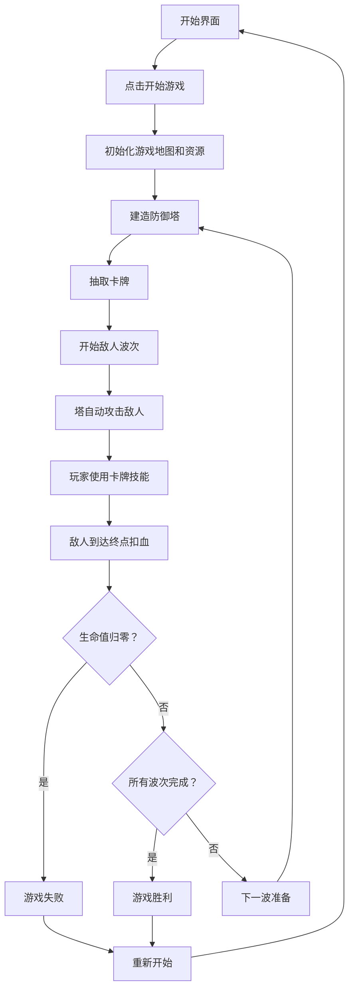

## 1. 产品概述

《魔法塔防：卡牌之战》是一款结合塔防与卡牌策略的网页游戏。玩家扮演一位小法师，在自己的领地上建造各种防御塔抵御敌人入侵，同时通过抽取和使用卡牌释放强大的魔法技能。

- 核心玩法：塔防建造 + 卡牌策略 + 波次敌人
- 目标用户：喜欢策略类游戏的休闲玩家
- 产品价值：融合两种经典玩法，提供新颖的策略体验

## 2. 核心功能

### 2.1 用户角色

| 角色 | 注册方式 | 核心权限 |
|------|----------|----------|
| 玩家 | 直接进入游戏 | 体验完整游戏内容 |

### 2.2 功能模块

1. **主游戏界面**：游戏地图、防御塔建造区、卡牌手牌区、状态栏
2. **防御塔系统**：箭塔、法师塔、冰冻塔三种塔类型，各有独特属性
3. **卡牌系统**：随机牌组、抽牌机制、手牌管理、技能释放
4. **敌人系统**：多种敌人类型、波次进攻、路径移动
5. **资源系统**：金币（建造塔）、法力值（使用卡牌）
6. **游戏流程**：开始、暂停、胜负判定、重新开始

### 2.3 页面详情

| 页面名称 | 模块名称 | 功能描述 |
|----------|----------|----------|
| 主游戏界面 | 游戏地图 | 显示敌人路径、可建造位置、已建造的塔 |
| 主游戏界面 | 塔选择面板 | 选择要建造的塔类型，显示价格和属性 |
| 主游戏界面 | 卡牌手牌区 | 显示当前手牌，点击使用卡牌技能 |
| 主游戏界面 | 状态栏 | 显示生命值、金币、法力值、当前波次 |
| 主游戏界面 | 游戏控制 | 开始/暂停、波次进度、游戏速度 |
| 开始界面 | 游戏标题 | 显示游戏名称和开始按钮 |
| 结算界面 | 胜负显示 | 显示胜利/失败结果和得分 |

## 3. 核心流程

玩家进入游戏后，首先看到开始界面。点击开始后，进入游戏主界面，初始拥有一定金币和法力值。玩家可以在建造点上放置防御塔，消耗金币。每波敌人开始前，玩家可以抽取卡牌。敌人沿路径前进，塔自动攻击范围内的敌人。玩家可以使用手牌中的卡牌释放技能，消耗法力值。如果敌人到达终点，玩家损失生命值。生命值归零则游戏失败，击退所有波次则胜利。

## 4. 用户界面设计

### 4.1 设计风格

- **主题色调**：深紫色与深蓝色为主的魔幻风格，搭配金色点缀
- **主色**：深紫蓝 (#1a1a2e)、暗紫 (#16213e)
- **辅助色**：金色 (#e94560)、魔法蓝 (#0f3460)、冰霜青 (#00d9ff)
- **背景**：渐变深色背景，带有魔法粒子效果
- **按钮风格**：圆角按钮，带有发光效果和悬停动画
- **字体**：标题使用具有魔法感的衬线字体，正文使用清晰易读的无衬线字体
- **图标风格**：扁平化魔法风格图标，使用 emoji 和 SVG 图标
- **整体感觉**：神秘、魔幻、精致，带有史诗感

### 4.2 页面设计概述

| 页面名称 | 模块名称 | UI 元素 |
|----------|----------|---------|
| 主游戏界面 | 游戏地图 | 网格路径、建造点高亮、塔动画、敌人移动动画 |
| 主游戏界面 | 塔选择面板 | 卡片式布局，悬停放大，选中发光 |
| 主游戏界面 | 卡牌手牌区 | 扇形排列，悬停上浮，使用时飞出动画 |
| 主游戏界面 | 状态栏 | 图标+数字，资源变化时有数字跳动动画 |
| 主游戏界面 | 游戏控制 | 玻璃拟态风格按钮 |
| 开始界面 | 游戏标题 | 大标题发光效果，魔法粒子背景 |
| 结算界面 | 胜负显示 | 居中弹窗，带有淡入缩放动画 |

### 4.3 响应性

- 桌面端优先设计
- 支持自适应布局，最小宽度 800px
- 游戏画布使用 Canvas 渲染，保持固定比例
- UI 面板使用 flex 布局自适应

### 4.4 视觉特效

- 塔攻击时有弹道特效和击中闪光
- 卡牌使用时有魔法光环和粒子扩散效果
- 敌人死亡时有消散动画
- 建造塔时有落地光效
- 背景有缓慢飘动的魔法粒子
