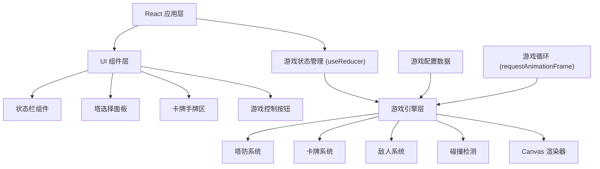

## 1. 架构设计

本项目为纯前端游戏，采用 React + Canvas 混合渲染架构。UI 部分使用 React 组件，游戏画面使用 Canvas 2D 渲染以保证性能。



## 2. 技术描述

- **前端框架**: React@18 + TypeScript
- **构建工具**: Vite
- **样式方案**: TailwindCSS@3
- **游戏渲染**: HTML5 Canvas 2D
- **状态管理**: React useReducer (游戏状态) + useState (UI状态)
- **后端**: 无（纯前端游戏）
- **数据库**: 无（使用 localStorage 存储最高分）

## 3. 核心模块定义

### 3.1 游戏常量与配置

| 配置项 | 类型 | 说明 |
|--------|------|------|
| TILE_SIZE | number | 地图格子大小 |
| MAP_WIDTH | number | 地图宽度（格子数） |
| MAP_HEIGHT | number | 地图高度（格子数） |
| INITIAL_GOLD | number | 初始金币 |
| INITIAL_MANA | number | 初始法力值 |
| INITIAL_LIVES | number | 初始生命值 |
| MAX_HAND_SIZE | number | 最大手牌数 |
| MANA_REGEN_RATE | number | 法力回复速率 |

### 3.2 塔类型定义

| 塔类型 | 伤害 | 攻速 | 射程 | 费用 | 特殊效果 |
|--------|------|------|------|------|----------|
| 箭塔 | 中 | 快 | 中 | 低 | 无 |
| 法师塔 | 高 | 慢 | 远 | 中 | 范围伤害 |
| 冰冻塔 | 低 | 中 | 中 | 中 | 减速效果 |

### 3.3 卡牌类型定义

| 卡牌 | 法力消耗 | 效果 |
|------|----------|------|
| 火球术 | 高 | 对目标区域造成大量伤害 |
| 冰冻术 | 中 | 冻结范围内敌人数秒 |
| 闪电链 | 中 | 连锁攻击多个敌人 |
| 治疗术 | 低 | 恢复少量生命值 |
| 金币雨 | 低 | 获得额外金币 |
| 强化塔 | 中 | 临时提升所有塔的攻击力 |

### 3.4 敌人类型定义

| 敌人 | 生命值 | 移动速度 | 奖励金币 |
|------|--------|----------|----------|
| 普通怪 | 低 | 中 | 少 |
| 快速怪 | 低 | 快 | 中 |
| 坦克怪 | 高 | 慢 | 多 |
| Boss | 极高 | 慢 | 很多 |

## 4. 目录结构

```
src/
├── components/          # React UI 组件
│   ├── GameCanvas.tsx   # 游戏画布组件
│   ├── StatusBar.tsx    # 状态栏
│   ├── TowerPanel.tsx   # 塔选择面板
│   ├── CardHand.tsx     # 卡牌手牌区
│   ├── StartScreen.tsx  # 开始界面
│   └── GameOver.tsx     # 结算界面
├── game/                # 游戏核心逻辑
│   ├── types.ts         # 类型定义
│   ├── config.ts        # 游戏配置
│   ├── engine.ts        # 游戏引擎
│   ├── tower.ts         # 塔系统
│   ├── card.ts          # 卡牌系统
│   ├── enemy.ts         # 敌人系统
│   ├── map.ts           # 地图系统
│   └── renderer.ts      # Canvas 渲染
├── hooks/               # 自定义 Hooks
│   └── useGameLoop.ts   # 游戏循环 Hook
├── App.tsx              # 主应用组件
├── main.tsx             # 入口文件
└── index.css            # 全局样式
```

## 5. 状态管理

### 5.1 游戏状态 (GameState)

```typescript
interface GameState {
  status: 'idle' | 'playing' | 'paused' | 'won' | 'lost';
  gold: number;
  mana: number;
  lives: number;
  wave: number;
  maxWaves: number;
  towers: Tower[];
  enemies: Enemy[];
  projectiles: Projectile[];
  effects: Effect[];
  deck: Card[];
  hand: Card[];
  discardPile: Card[];
  selectedTowerType: TowerType | null;
  selectedCard: Card | null;
}
```

### 5.2 游戏动作 (GameAction)

- `START_GAME`: 开始游戏
- `PAUSE_GAME`: 暂停游戏
- `RESUME_GAME`: 继续游戏
- `BUILD_TOWER`: 建造塔
- `SELECT_TOWER_TYPE`: 选择塔类型
- `DRAW_CARD`: 抽牌
- `PLAY_CARD`: 使用卡牌
- `SELECT_CARD`: 选择卡牌
- `NEXT_WAVE`: 下一波
- `TICK`: 游戏帧更新

## 6. 性能优化

- 使用 Canvas 2D 渲染游戏画面，避免 DOM 操作开销
- 游戏循环使用 requestAnimationFrame
- 对象池管理敌人和子弹，减少 GC
- 离屏 Canvas 预渲染静态元素
- 使用 requestIdleCallback 处理非关键逻辑
